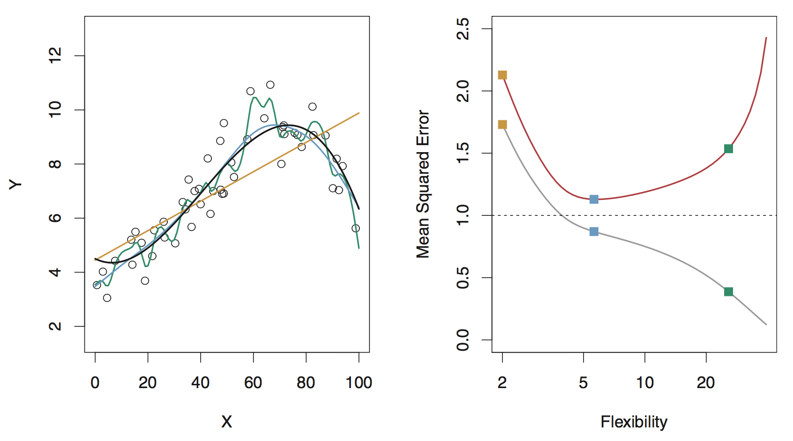
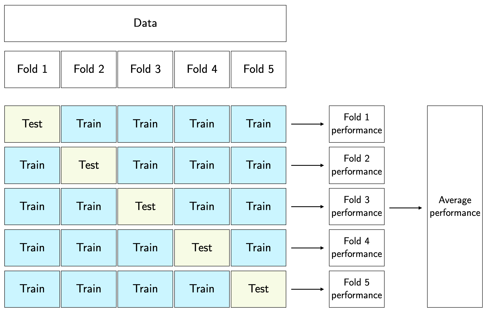

```{r}
#| include: false
knitr::opts_chunk$set(
  echo = TRUE,
  message = FALSE,
  warning = FALSE,
  fig.align = "center",
  fig.height = 9
)
library(tidyverse)
theme_set(theme_light())
ggplot2::theme_set(ggplot2::theme_light(base_size = 20))
```

# Variable selection

## Old school approaches (not recommended)

* Best subset selection

* Forward/backward/stepwise selection

. . .

* Limitations

  * only feasible for a smaller number of variables

  * computationally infeasible for a large number of predictors

  * arbitrary way of defining the best model and ignores contextual knowledge about potential predictors

## Variable selection is a difficult problem!

* Like much of a statistics research, there is not one unique, correct answer

. . .

* Do not turn off your brain! Algorithms can be tempting but they are NOT substitutes!

. . .

* Justify which predictors used in modeling based on:

  * domain knowledge
  
  * extensive EDA
  
  * model assessment based on holdout predictions (w/ cross-validation, we'll discuss this in a bit)
  
. . .

* Be a responsible modeler!

## Confounding variables

A **confounding variable** (or lurking variable) is one that is associated with both
the response and predictor variables

. . .

* It can be tempting to immediately jump to conclusions when faced with a strong association between the variables

* However, it is important to stop and think about whether there are confounding variables which could be explaining the association instead

## Confounding variables

In studying the relationship between a predictor $X$ and a response variable $Y$,

*   We should adjust for **confounding variables** that can influence that relationship because they are associated both with $X$ and with $Y$

*   If the variable is a potential confounder, including it in the model may help to reduce bias in estimating relevant effects of key explanatory variables

## Confounding variables

Example: Examine the impact of fertilizer on the yield of an apple orchard

* Suppose researchers are studying the relationship between the amount of fertilizer used and the yield of apple orchards

. . .

* They fit a model with the yield as the response and amount of fertilizer used as the single predictor

. . .

* But, there are many possible confounding variables that might be associated with both the amount of fertilizer used and the yield (e.g., quality of soil, weather, etc.)

. . .

* These variables, if included in the data, should also be adjusted for in the model


# The trade-offs

## Which model(s) should I use in my analysis?

. . .

* The answer: __IT DEPENDS__ 

. . .


* Setup: Let $Y$ be the response variable, and $X = (X_1, X_2, \dots, X_p)$ be the predictors

  * We want to fit a model to estimate an unknown function $f$ describing the relationship between $Y$ and $X$

  * The learned model will take the form $\hat{Y}=\hat{f}(X)$

. . .

* What is the goal of your modeling problem?

  * If you care more about the details of $\hat{f}(X)$, then it's an **inference** problem

  * If you care more about predictive power, then it's a **prediction** problem

. . .

* Any algorithm can be used for prediction, however options are limited for inference

. . .

* Active area of research: inference for black box models

## Some trade-offs

* Model flexibility vs interpretability

  * Linear models are easy to interpret; boosted trees are not
  
. . .
  
* Good fit vs overfit or underfit

  * How do we know when the fit is just right?
  
. . .
  
* Parsimony vs black-box

  * A simpler model with fewer variables vs a black-box involving more (or all) predictors?

## Model flexibility vs interpretability

* Generally speaking: trade-off between a model's _flexibility_ (i.e. how "wiggly" it is) and how __interpretable__ it is

. . .

* **Parametric** methods: we make an assumption about the functional form, or shape, of $f$ before observing the data


. . .

* **Nonparametric** methods: we do not make explicit assumptions about the functional form of $f$ (i.e., $f$ is estimated from the data)

. . .

* Parametric models are generally easier to interpret, whereas nonparametric models are more flexible

. . .

* If your goal is prediction, your model can be as arbitrarily flexible as it needs to be (but be careful...)

. . .

* If your goal is inference, there are clear advantages to using simpler and more interpretable models

## Measuring the quality of model fit

* Suppose we fit a model to some training data and we wish to see how well it performs

. . .

* In the regression setting, we could compute the mean squared error (MSE) over the training set $$\text{MSE}_{\texttt{train}} = \frac{1}{n} \sum_{i \in \texttt{train}} (y_i - \hat f(x_i))^2$$

. . .

* But this may be biased toward more overfit models

. . .

* Instead, we should compute the MSE using previously unseen test (holdout) data (i.e. data not used to train the model) to ensure generalizability $$\text{MSE}_{\texttt{test}} = \frac{1}{n} \sum_{i \in \texttt{test}} (y_i - \hat f(x_i))^2$$

. . .

* MSE is an example of a loss/objective/cost function---a performance measure that represents the quality of a model fit

## Model flexibility and assessment example

**Black** curve (left): truth

<b><span style = "color:#d89e27;">Orange</span></b>, <b><span style = "color:#34b4fc;">blue</span></b> and <b><span style = "color:#019e85;">green</span></b> curves/squares: fits of different flexibility

<b><span style = "color:#a6b3c6;">Gray</span></b> curve (right): $\text{MSE}_{\texttt{train}}$.
<b><span style = "color:#c3343c;">Red</span></b> curve (right): $\text{MSE}_{\texttt{test}}$

<center>
{height="470"}
</center>

## Model flexibility and assessment example

<br>

<b><span style = "color:black;">Black</span></b> curve (left): true model

Data are generated from a smoothly varying non-linear model with random noise added

<center>
{height="470"}
</center>

## Model flexibility and assessment example

<b><span style = "color:#d89e27;">Orange</span></b> line (left): linear regression fit: inflexible, fully parametrized, underfitting

<b><span style = "color:#019e85;">Green</span></b> curve (left): an overly flexible, nonparametric model: overfits (follows noise too closely)

<b><span style = "color:#34b4fc;">Blue</span></b> curve (left): aims to strike a balance, not too smooth, not too wiggly.

<center>
{height="470"}
</center>

## Model flexibility and assessment example

<br>

<b><span style = "color:#a6b3c6;">Gray</span></b> line (right): training error (MSE) decreases as flexibility increases.

<b><span style = "color:#c3343c;">Red</span></b> line (right): test error (MSE) decreases until a "sweet spot", then  increases due to overfitting

<center>
{height="470"}
</center>

## Bias-variance trade-off

* Typical trend

  * Underfitting means high bias & low variance (fitting a line to the data)
  
  * Overfitting means low bias & high variance (drawing a wiggly curve that passes through every single training observation)
  
. . .

* Generally, as the flexibility of a model fit increases, its variance increases, and its bias decreases

. . .

* So choosing the flexibility based on average test error amounts to a bias-variance trade-off


## Bias-variance trade-off

<b><span style = "color:#d89e27;">Orange</span></b> curve/squares (linear model): high bias, low variance 

<b><span style = "color:#019e85;">Green</span></b> curve/squares (overly flexible model): low bias, high variance

<b><span style = "color:#34b4fc;">Blue</span></b> curve/squares: optimal ("just right") amount of flexibility is somewhere in the middle 


<center>
{height="470"}
</center>


## Bias-variance trade-off: thought experiments

. . .

Can we ever predict $Y$ from $X$ with zero error? 

. . .

* Generally, no... even the true $f$ cannot generically do this, and will incur some error due to noise

* This is called the irreducible error $\epsilon$

. . .

What happens if our fitted model $\hat f$ belongs to a model class that is far from the true $f$?

. . .

* For example, we fit a linear model in a setting where the true relationship is far from linear

* As a result, we encounter a source of error: estimation **bias**

. . .

What happens if our fitted model $\hat f$ is itself quite variable? 

. . .

* In other words, over different training sets, we end up constructing substantially different $\hat f$

* This is another source of error: estimation **variance**


## Bias-variance decomposition

* The expected test error, conditional on $X = x$ for some $x$, can be decomposed as $$\mathbb E[(Y - \hat f(x))^2 \mid X = x] =  \text{Bias}^2[\hat f(x)] + \text{Var}[\hat f(x)] + \text{Var}[\epsilon]$$

. . .

* In order to minimize the expected test error, we need a model that simultaneously achieves low variance and low bias

. . .

* But, the variance is a nonnegative quantity, and squared bias is also nonnegative

. . .

* Thus, there's a trade-off between bias and variance

  * Even if our prediction is unbiased, we can still incur a large error if it is highly variable
  
  * Meanhile, even when our prediction is stable and not variable, we can incur a large error if it is badly biased

## "The sweet spot"

<blockquote class="twitter-tweet"><p lang="en" dir="ltr">Remember, when building predictive models, try to find the sweet spot between bias and variance. <a href="https://twitter.com/hashtag/babybear?src=hash&amp;ref_src=twsrc%5Etfw">#babybear</a></p>&mdash; Dr. G. J. Matthews (@StatsClass) <a href="https://twitter.com/StatsClass/status/1037808217076760576?ref_src=twsrc%5Etfw">September 6, 2018</a></blockquote> <script async src="https://platform.twitter.com/widgets.js" charset="utf-8"></script>

## Check out this song

<center>

</center>

## Principle of parsimony (Occam's razor)

"Numquam ponenda est pluralitas sine necessitate" (plurality must never be posited without necessity)

From ISLR:

> When faced with new data modeling and prediction problems, it's tempting to always go for the trendy new methods. Often they give extremely impressive results, especially when the datasets are very large and can support the fitting of high-dimensional nonlinear models. However, if we can produce models with the simpler tools that perform as well, they are likely to be easier to fit and understand, and potentially less fragile than the more complex approaches. Wherever possible, it makes sense to try the simpler models as well, and then make a choice based on the performance/complexity trade-off.

In short: "When faced with several methods that give roughly equivalent performance, pick the simplest."

## The curse of dimensionality

* The more features, the merrier?... Not so fast, my friend.

. . .

* Adding additional **signal** features that are truly associated with the response will improve the fitted model

    * Reduction in test set error
    
. . . 
    
* Adding **noise** features that are not truly associated with the response will lead to a deterioration in the model

    * Increase in test set error
    
    * **Noise features increase the dimensionality of the problem, exacerbating the risk of overfitting**
    
    * (Noise features may be associated with the response on the training set due to chance)
    
# Cross-validation    

## $K$-fold cross-validation

* Randomly split the observations into $K$ (roughly) equal-sized folds (usually $k=5$ or $k=10$)
  
* For each fold $k=1,2,\dots,K$
  
  * Fit the model on data excluding observations in fold $k$
    
  * Obtain predictions and performance measure (e.g. MSE) for the left-out fold $k$
    
* Aggregate performance measure across $k$ folds
  
  * e.g., compute average MSE, including standard error for CV estimate

. . .    

We can justify model choice (e.g. model selection/comparison, variable selection, tuning parameter selection) using any performance measure we want with CV

## (5-fold) cross-validation procedure diagram

<center>
{height="550"}
</center>

## Some notes on cross-validation

* Recall that the typical cross-validation procedure randomly assigns individual observations to different folds

. . .

* In more complex data settings (e.g. correlated data, nested data), figuring out the appropriate way to split the observations into folds can require careful thoughts

. . .

* For example, if the data are spatially or temporally dependent, we can’t simply assign individual observations to folds (which may result in data leakage)

. . .

* To preserve any dependence structure of the data, we can assign groups/blocks of observations together into different folds

## Cross-validation example: model comparison

* Data on Capital Bikeshare, similar to linear regression lecture

```{r load-data, warning = FALSE, message = FALSE}
library(tidyverse)
theme_set(theme_light())
bikes <- read_csv("https://raw.githubusercontent.com/36-SURE/2025/refs/heads/main/data/bikes.csv")
```

```{r}
#| echo: false
ggplot2::theme_set(ggplot2::theme_light(base_size = 25))
```


* Compare the following model for predicting number of bikeshare rides

  * Model 1: includes only 1 predictor--feels like temperature
  
  * Model 2: includes 2 predictors--feels like temperature and season
  
  * Model 3: same as model 2, but adding the interaction between temperature and season

## Assigning observations to fold

* Perform 5-fold cross-validation to assess model performance

* Create a column of test fold assignments to our dataset with the `sample()` function

* Always remember to `set.seed()` prior to performing cross-validation

```{r}
set.seed(100)
N_FOLDS <- 5
bikes <- bikes |>
  mutate(fold = sample(rep(1:N_FOLDS, length.out = n())))
# table(bikes$fold)
```

## Model comparison based on out-of-sample performance

Function to perform cross-validation

```{r}
bikes_cv <- function(x) {
  
  # get test and training data
  test_data <- bikes |> filter(fold == x)                     
  train_data <- bikes |> filter(fold != x)
  
  # fit models to training data
  interaction_fit <- lm(rides ~ temp_feel * season, data = train_data)
  temp_season_fit <- lm(rides ~ temp_feel + season, data = train_data)
  temp_fit <- lm(rides ~ temp_feel, data = train_data)
  
  # return test results
  out <- tibble(
    interaction_pred = predict(interaction_fit, newdata = test_data),
    temp_season_pred = predict(temp_season_fit, newdata = test_data),
    temp_pred = predict(temp_fit, newdata = test_data),
    test_actual = test_data$rides,
    test_fold = x
  )
  return(out)
}
```

```{r}
bikes_test_preds <- map(1:N_FOLDS, bikes_cv) |> 
  bind_rows()
```

## Model comparison based on out-of-sample performance

Compute RMSE across folds with standard error intervals

```{r}
bikes_test_summary <- bikes_test_preds |>
  pivot_longer(interaction_pred:temp_pred, names_to = "model", values_to = "test_pred") |>
  group_by(model, test_fold) |>
  summarize(rmse = sqrt(mean((test_actual - test_pred)^2)))

bikes_test_summary |> 
  group_by(model) |> 
  summarize(avg_cv_rmse = mean(rmse),
            sd_rmse = sd(rmse),
            k = n()) |>
  mutate(se_rmse = sd_rmse / sqrt(k),
         lower_rmse = avg_cv_rmse - se_rmse,
         upper_rmse = avg_cv_rmse + se_rmse) |> 
  select(model, avg_cv_rmse, lower_rmse, upper_rmse)
```

## Visualizing model performance results

::: columns
::: {.column width="50%" style="text-align: left;"}

```{r}
bikes_test_summary |> 
  ggplot(aes(x = model, y = rmse)) + 
  geom_point(size = 4) +
  stat_summary(fun = mean, geom = "point", 
               color = "red", size = 4) + 
  stat_summary(fun.data = mean_se, geom = "errorbar", 
               color = "red", width = 0.2)
```

:::


::: {.column width="50%" style="text-align: left;"}

* Including season (together with temperature) clearly provides better model performance

* Including an interaction term between season and temperature is not worthwhile<br>(in fact, the performance is slightly worse compared to the model without interaction)

:::

:::


# Model building checklist

## Make sure to justify the model choice

Why is your model appropriate for the problem?

*   For simplicity and explanability purpose? (Why do you prefer a simpler model over a black box?)

*   For complexity and flexibility purpose? (Why do you prefer a black box over a simpler model?)

. . .

How do you evaluate your model?

*   Do you compare it with other models? Do you have a baseline model?

*   Do you compare it with alternative specifications (e.g. different set of predictors)?

. . .

How do you choose the predictors?
    
*   domain knowledge?
    
*   extensive EDA?
    
*   model assessment based on holdout predictions?


## Make sure to report uncertainty for whatever you’re estimating

Don't just say "we find a statistically significant association between Y and X..."

* What do those coefficient estimates tell you? Interpret in context

* How large/small is the effect size?

* What's the margin of error?

* Did the model also adjust for other potential meaningful predictors?
    
. . .

This also applies to ($k$-fold) cross-validation results

* Report the average of the performance measure (e.g. MSE, accuracy, etc.) across the $k$ test set along with standard errors

* In some cases, all $k$ folds yield similar results, but in other cases, the results are vastly different across the folds

* Without some indication of uncertainty, no one will have a clue of how reliable your results are