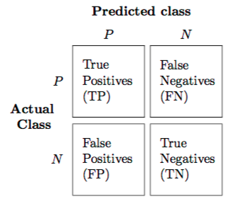

```{r}
#| include: false
knitr::opts_chunk$set(
  echo = TRUE,
  message = FALSE,
  warning = FALSE,
  fig.align = "center",
  fig.height = 9
)
library(tidyverse)
```

# Background

## Classification

* Categorical variables take values in an unordered set with different categories

. . .

* Classification: predicting a categorical response $Y$ for an observation (since it involves assigning the observation to a category/class)

. . .

* Often, we are more interested in estimating the probability for each category of the response $Y$

. . .

* Classification is different from clustering, since we know the true label $Y$

. . .

* We will first focus on binary categorical response (categorical response variables with only two categories)

    *   Examples: whether it will rain or not tomorrow, whether the kicker makes or misses a field goal attempt

## Logistic regression

* Review: in linear regression, the response variable $Y$ is quantitative

. . .

* Logistic regression is used to model binary categorical outcomes (i.e. $Y \in \{0, 1\}$)

. . .

* Similar concepts from linear regression

  *   tests for coefficients
  *   indicator variables
  *   interactions
  *   model building procedure
  *   regularization
  
. . .

* Other concepts are different
  
  *   interpretation of coefficients
  *   residuals are not normally distributed
  *   model evaluation

## Why not linear regression for categorical data?

```{r out.width='90%', echo = FALSE, fig.align='center'}
knitr::include_graphics("http://www.stat.cmu.edu/~pfreeman/Figure_4.2.png")
```

. . .

::: columns
::: {.column width="60%" style="text-align: left;"}

**Linear regression:** predicted probabilities might be outside the $[0, 1]$ interval

:::


::: {.column width="40%" style="text-align: left;"}

**Logistic regression:** ensures all probabilities lie between 0 and 1

:::
:::


## Logistic regression

* Logistic regression models the probability of success $p(x)$ of a binary categorical response variable $Y \in \{0, 1\}$

. . .

* To limit the regression between $[0, 1]$, we use the __logit__ function, or the __log-odds ratio__

$$
\log \left( \frac{p(x)}{1 - p(x)} \right) = \beta_0 + \beta_1 x_1 + \cdots + \beta_p x_p
$$

. . .

or equivalently,

$$
p(x) =  \frac{e^{\beta_0 + \beta_1 x_1 + \cdots + \beta_p x_p}}{1 + e^{\beta_0 + \beta_1 x_1 + \cdots + \beta_p x_p}}
$$

. . .


*   Note: $p(x)= P(Y = 1 \mid X = x) = \mathbb E[Y \mid X = x]$


## Maximum likelihood estimation (MLE)

*   Likelihood function: how likely to observe data for given parameter values $$L(\theta) = \prod_{i=1}^n f(y_i; \theta)$$

. . .

*   Goal: find values for parameters that maximize likelihood function (i.e., MLEs)

. . .

*   Why: likelihood methods can handle variety of data types and assumptions

. . .

*   How: typically numerical approaches and optimization techniques

    *   Easier to work with log-likelihood (sums compared to products)
    
## Example: linear regression MLE

Reminder: probability density function (pdf) for a normal distribution $$f(y \mid \mu, \sigma) = \frac{1}{\sqrt{2\pi \sigma^2}} e^{\frac{-(y - \mu) ^ 2}{2 \sigma^2}}$$

. . .

Consider a simple linear regression model (with an intercept and one predictor) $$y_i = \beta_0 + \beta_1 x_i + \epsilon_i, \quad \epsilon_i \sim N(0, \sigma^2)$$

. . .

Then $\qquad \displaystyle L(\beta_0, \beta_1, \sigma) = \prod_{i=1}^n f(y_i \mid x_i; \beta_0, \beta_1, \sigma) = \prod_{i=1}^n \frac{1}{\sqrt{2\pi \sigma^2}} e^{\frac{-(y_i - \beta_0 - \beta_1 x_i) ^ 2}{2 \sigma^2}}$

. . .

And $\qquad \displaystyle \log L(\beta_0, \beta_1, \sigma) =  -\frac{n}{2} \log 2\pi - \frac{n}{2} \log \sigma^2 - \frac{1}{2 \sigma^2} \sum_{i=1}^n (y_i - \beta_0 - \beta_1x_1)^2$

. . .

We can then use optimization methods (e.g., simple calculus) to find the optimal parameter values. 

For more details, see [here](https://www.stat.cmu.edu/~cshalizi/mreg/15/lectures/06/lecture-06.pdf)

## Major difference between linear and logistic regression

Logistic regression __involves numerical optimization__

- $y_i$ is observed response for $n$ observations, either 0 or 1


. . .

- We need to use an iterative algorithm to find $\beta$'s that maximize the __likelihood__ $$\prod_{i=1}^{n} p\left(x_{i}\right)^{y_{i}}\left(1-p\left(x_{i}\right)\right)^{1-y_{i}}$$


. . .

- __Newton's method__: start with initial guess, calculate gradient of log-likelihood, add amount proportional to the gradient to parameters, moving up log-likelihood surface


. . .

- This means logistic regression runs more slowly than linear regression

. . .

- Another approach (if you're interested): iteratively re-weighted least squares, see [here](http://www.stat.cmu.edu/~cshalizi/uADA/15/lectures/12.pdf)


## Inference with logistic regression

* __Major motivation__ for logistic regression (and all GLMs) is __inference__

    *   How does the response change when we change a predictor by one unit?

. . .

* For linear regression, the answer is straightforward 

$$\mathbb{E}[Y \mid x] = \beta_0 + \beta_1 x_1 + + \cdots + \beta_p x_p$$

. . .

* For logistic regression, it is a little _less_ straightforward 

$$\mathbb E[Y \mid x] = \frac{e^{\beta_0 + \beta_1 x_1 + \cdots + \beta_p x_p}}{1 + e^{\beta_0 + \beta_1 x_1 + \cdots + \beta_p x_p}}$$

. . .

Note: 

* The predicted response varies __non-linearly__ with the predictor variable values

*   Interpretation on the __odds__ scale


## The odds interpretation

The odds of an event are the probability of the event divided by the probability of the event not occurring

* $\displaystyle \text{odds} = \frac{\text{probability}}{1 - \text{probability}}$

* $\displaystyle \text{probability} = \frac{\text{odds}}{1 + \text{odds}}$

Example: Rolling a fair six-sided die

*   The probability of rolling a 2 is 1/6

*   The odds of rolling a 2 is 1 to 5 (or 1:5)

## The odds interpretation

Suppose we fit a simple logistic regression model (with one predictor), and say the predicted probability is 0.8 for a particular predictor value

*   This means that if we were to repeatedly sample response values given that predictor variable value: __we expect class 1 to appear 4 times as often as class 0__ $$\text{odds} = \frac{\mathbb{E}[Y \mid x]}{1-\mathbb{E}[Y \mid x]} = \frac{0.8}{1-0.8} = 4 = e^{\beta_0+\beta_1x}$$

*   Thus we say that for the given predictor variable value, the odds are 4 (or 4:1) in favor of class 1

. . .

How does the odds change if we change the value of a predictor variable by one unit?

. . .

$$\text{odds}_{\rm new} = e^{\beta_0+\beta_1(x+1)} = e^{\beta_0+\beta_1x}e^{\beta_1} = e^{\beta_1}\text{odds}_{\rm old}$$

For every unit change in $x$, the odds change by a __factor__ $e^{\beta_1}$

# Example


## Data: diabetes in the Pima

* Each observation represents one Pima woman, at least 21 years old, who was tested for diabetes as part of the study. 

* `type`: if they had diabetes according to the diagnostic criteria

* `npreg`: number of pregnancies

* `bp`: blood pressure

```{r, warning = FALSE, message = FALSE}
library(tidyverse)
theme_set(theme_light())
pima <- as_tibble(MASS::Pima.tr)
pima <- pima |> 
  mutate(pregnancy = ifelse(npreg > 0, "Yes", "No")) # whether the patient has had any pregnancies
```

```{r}
#| echo: false
ggplot2::theme_set(ggplot2::theme_light(base_size = 20))
```


## Fitting a logistic regression model

- Use the `glm` function, but specify the family is `binomial`
- Get coefficients table using the `tidy()` function in the `broom` package

```{r init-logit}
pima_logit <- glm(type ~ pregnancy + bp, data = pima, family = binomial)
library(broom)
# summary(pima_logit)
tidy(pima_logit)
```

. . .

- Exponentiate the coefficient estimates (log-odds) to back-transform and get the odds

```{r}
tidy(pima_logit, conf.int = TRUE, exponentiate = TRUE)
```
    
## Interpreting a logistic regression model

```{r}
tidy(pima_logit)
```

. . .

* Pregnancy: pregnancy changes the log-odds of diabetes, relative to the baseline value, by -0.468. The odds ratio is exp(-0.47) = 0.626

. . .

*   Blood pressure: each unit of increase in blood pressure (in mmHg) is associated with an increase in the log-odds of diabetes of 0.0403, or an increase in the odds of diabetes by a multiplicative factor of exp(0.0403) = 1.04

    *   Every extra mmHg in blood pressure multiplies the odds of diabetes by 1.04

## View predicted probability relationship

```{r}
pima |> 
  mutate(pred_prob = fitted(pima_logit),
         i_type = as.numeric(type == "Yes")) |> 
  ggplot(aes(bp)) +
  geom_line(aes(y = pred_prob, color = pregnancy), linewidth = 2) +
  geom_point(aes(y = i_type), alpha = 0.3, color = "darkorange", size = 4)
```

## [Deviance](https://en.wikipedia.org/wiki/Deviance_(statistics))

* Recall that in linear regression, we have the residual sum of squares (RSS)---an RSS of 0 means the model predicts perfectly

* In logistic regression, the RSS is less meaningful; instead we define the **deviance** as a measure of **goodness-of-fit**s

* Generalization of RSS in linear regression to any distribution family


## [Deviance](https://en.wikipedia.org/wiki/Deviance_(statistics))

* For model of interest $\mathcal{M}$ the total deviance is

$$D_{\mathcal{M}}= -2 \log \frac{\mathcal{L}_{\mathcal{M}}}{\mathcal{L}_{\mathcal{S}}} = 2\left(\log  \mathcal{L}_{\mathcal{S}}-\log  \mathcal{L}_{\mathcal{M}}\right)$$

* $\mathcal{L}_{\mathcal{M}}$ is the likelihood for model $\mathcal{M}$

. . .

* $\mathcal{L}_{\mathcal{S}}$ is the likelihood for the __saturated__ model (i.e., the most complex model possible, providing a perfect fit to the data)

. . .

* __Deviance is a measure of goodness-of-fit__: the smaller the deviance, the better the fit

For more, see [here](https://bookdown.org/egarpor/PM-UC3M/glm-deviance.html)


## Model summaries

```{r}
glance(pima_logit)
```

* `deviance` = `2 * logLik`

* `null.deviance` corresponds to intercept-only model

* `AIC` = `2 * df.residual - 2 * logLik`

* **We will consider these to be less important than out-of-sample/test set performance**

## Predictions

- The default output of `predict()` is on __the log-odds scale__

- To get predicted probabilities, specify `type = "response`

```{r}
pima_pred_prob <- predict(pima_logit, type = "response")
```

- How do we predict the class (diabetes or not)?

- Typically if predicted probability is > 0.5 then we predict `Yes`, else `No`

  -   Could also be encoded as `1` and `0`

```{r}
pima_pred_class <- ifelse(pima_pred_prob > 0.5, "Yes", "No")
pima_pred_binary <- ifelse(pima_pred_prob > 0.5, 1, 0)
```

## Classification model assessment

* Accuracy and misclassification rate

```{r mcr}
mean(pima_pred_class == pima$type)
mean(pima_pred_class != pima$type)
```

* [Brier score](https://en.wikipedia.org/wiki/Brier_score) (similar to MSE for regression)

```{r brier}
mean((pima_pred_binary - pima_pred_prob)^2)
```

* Confusion matrix

```{r confuse}
table("Predicted" = factor(pima_pred_class, levels = c("Yes", "No")), 
      "Observed" = factor(pima$type, levels = c("Yes", "No")))
```

## Confusion matrix

<center>

</center>

* **Accuracy**: How often is the classifier correct? $(\text{TP} + \text{TN}) \ / \ {\text{total}}$

* **Precision**: How often is it right for predicted positives? $\text{TP} \ / \  (\text{TP} + \text{FP})$

* **[Sensitivity](https://en.wikipedia.org/wiki/Sensitivity_and_specificity)** (or true positive rate (TPR) or power): How often does it detect positives? $\text{TP} \ / \  (\text{TP} + \text{FN})$

* **Specificity** (or true negative rate (TNR), or 1 - false positive rate (FPR)): How often does it detect negatives? $\text{TN}  \ / \ (\text{TN} + \text{FP})$

## Receiver operating characteristic (ROC) curve

* Question: How do we balance between high power and low false positive rate?

. . .

* In general, we can obtain predicted class for each observation by comparing the predicted probability to some cutoff $c$ (typically, $c=0.5$) $$\hat{Y} =\left\{\begin{array}{ll} 1, & \hat{p}(x)>c \\ 0, & \hat{p}(x) \leq c \end{array}\right.$$

. . .

* ROC curve: check all possible values for the cutoff $c$, plot the power against false positive rate

## Receiver operating characteristic (ROC) curve

* Want to maximize the __area under the curve (AUC)__

```{r out.width='60%', echo = FALSE, fig.align='center'}
knitr::include_graphics("https://bradleyboehmke.github.io/HOML/02-modeling-process_files/figure-html/modeling-process-roc-1.png")
```

## Calculating AUC & plotting an ROC curve

::: columns
::: {.column width="50%" style="text-align: left;"}

```{r}
library(pROC)
pima_roc <- pima |> 
  mutate(pred_prob = predict(pima_logit, 
                             type = "response")) |> 
  roc(type, pred_prob)
# str(pima_roc)
pima_roc$auc
```

```{r}
#| eval: false
tibble(threshold = pima_roc$thresholds,
       specificity = pima_roc$specificities,
       sensitivity = pima_roc$sensitivities) |> 
  ggplot(aes(x = 1 - specificity, y = sensitivity)) +
  geom_path() +
  geom_abline(slope = 1, intercept = 0, 
              linetype = "dashed")
```


:::

::: {.column width="50%" style="text-align: left;"}

```{r}
#| echo: false
tibble(threshold = pima_roc$thresholds,
       specificity = pima_roc$specificities,
       sensitivity = pima_roc$sensitivities) |> 
  ggplot(aes(x = 1 - specificity, y = sensitivity)) +
  geom_path() +
  geom_abline(slope = 1, intercept = 0, 
              linetype = "dashed")
```

:::
:::

## Calibration

* Classification models go beyond providing binary predictions and instead produce predicted probabilities for each class

. . .

* It might be desirable to assess the quality of the predicted probabilities instead of just the accuracy of the crude predicted class labels

. . .

* From The Signal and the Noise (by Nate Silver):

> One of the most important tests of a forecast — I would argue that it is the single most important one — is called calibration. Out of all the times you said there was a 40 percent chance of rain, how often did rain actually occur? If, over the long run, it really did rain about 40 percent of the time, that means your forecasts were well calibrated. If it wound up raining just 20 percent of the time instead, or 60 percent of the time, they weren’t.

## Calibration

* For a model to be calibrated, the predicted probabilities should match the actual probabilities (actual likelihood of an event occurring)

. . .

* For example, if we’ve got a model which tells us that the probability of rain on a certain class of days is 50%, it had better rain on half of those days in reality, or there model is just wrong about the probability of rain

. . .

* Calibration should be used together with other model evaluation and diagnostic tools

. . .

* A model is well-calibrated does not mean it is good at making predictions (example: a constant classifier)

. . .

See also: [Hosmer-Lemeshow test](https://en.wikipedia.org/wiki/Hosmer-Lemeshow_test)

## Calibration plot: smoothing

::: columns
::: {.column width="50%" style="text-align: left;"}

Plot the observed outcome against the fitted probability, and apply a smoother

```{r}
#| eval: false
pima |> 
  mutate(pred = predict(pima_logit, type = "response"),
         obs = ifelse(type == "Yes", 1, 0)) |> 
  ggplot(aes(pred, obs)) +
  geom_point() +
  geom_smooth(se = FALSE) +
  geom_abline(slope = 1, intercept = 0, 
              linetype = "dashed") 
```

Looks good for the most part

*   odd behavior for high probability values

*   since there are only a few observations with high predicted probability

:::


::: {.column width="50%" style="text-align: left;"}

```{r}
#| echo: false  
pima |> 
  mutate(pred = predict(pima_logit, type = "response"),
         obs = ifelse(type == "Yes", 1, 0)) |> 
  ggplot(aes(pred, obs)) +
  geom_point(size = 3) +
  geom_smooth(se = FALSE) +
  geom_abline(slope = 1, intercept = 0, linetype = "dashed") 
```

:::
:::

## Calibration plot: binning

::: columns
::: {.column width="50%" style="text-align: left;"}

```{r}
#| eval: false
pima |> 
  mutate(
    pred_prob = predict(pima_logit, type = "response"),
    bin_pred_prob = cut(pred_prob, breaks = seq(0, 1, .1))
  ) |> 
  group_by(bin_pred_prob) |> 
  summarize(n = n(),
            bin_actual_prob = mean(type == "Yes")) |> 
  mutate(mid_point = seq(0.15, 0.65, 0.1)) |> 
  ggplot(aes(x = mid_point, y = bin_actual_prob)) +
  geom_point(aes(size = n)) +
  geom_line() +
  geom_abline(slope = 1, intercept = 0, 
              color = "black", linetype = "dashed") +
  # expand_limits(x = c(0, 1), y = c(0, 1)) +
  coord_fixed()
```

:::


::: {.column width="50%" style="text-align: left;"}

```{r}
#| echo: false
pima |> 
  mutate(pred_prob = predict(pima_logit, type = "response"),
         bin_pred_prob = cut(pred_prob, breaks = seq(0, 1, 0.1))) |> 
  group_by(bin_pred_prob) |> 
  summarize(n = n(),
            bin_actual_prob = mean(type == "Yes")) |> 
  mutate(mid_point = seq(0.15, 0.65, 0.1)) |> 
  ggplot(aes(x = mid_point, y = bin_actual_prob)) +
  geom_point(aes(size = n)) +
  geom_line() +
  geom_abline(slope = 1, intercept = 0, 
              color = "black", linetype = "dashed") +
  # expand_limits(x = c(0, 1), y = c(0, 1)) +
  coord_fixed()
```

:::
:::

## Other calibration methods

*   [Platt scaling](https://en.wikipedia.org/wiki/Platt_scaling)

*   [Isotonic regression](https://en.wikipedia.org/wiki/Isotonic_regression)

*   [Beta calibration](https://doi.org/10.1214/17-EJS1338SI)

*   [`probably`](https://www.tidyverse.org/blog/2022/11/model-calibration/) package in R

*   Formally, a classifier is calibrated (or well-calibrated) when $P(Y = 1 \mid\hat p(X) = p) = p$
