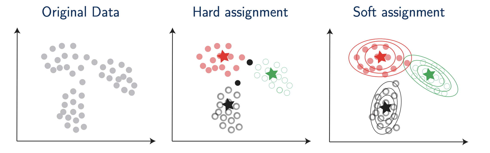
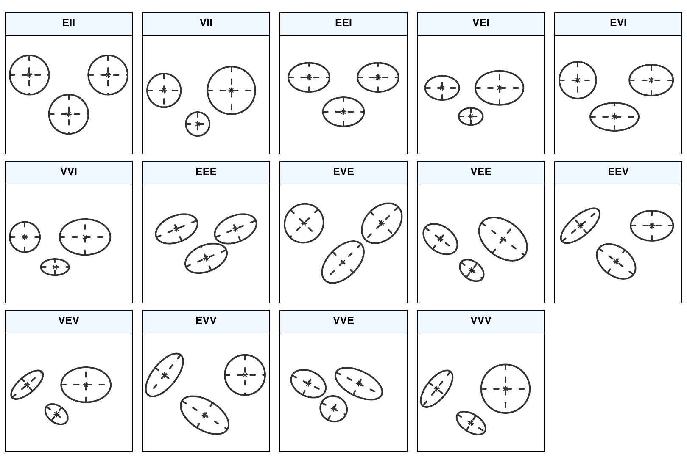
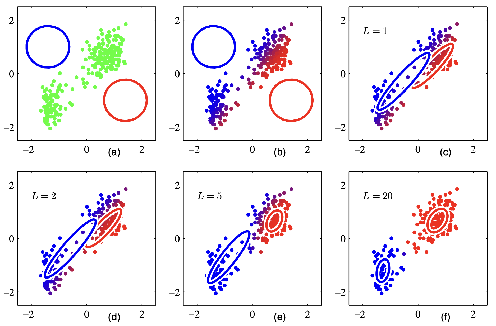

```{r}
#| include: false
knitr::opts_chunk$set(
  echo = TRUE,
  message = FALSE,
  warning = FALSE,
  fig.align = "center",
  fig.height = 9
)
library(tidyverse)
ggplot2::theme_set(ggplot2::theme_light(base_size = 20))
```

# Background

## Previously: clustering

Goal: partition observations into subgroups/cluster, where points within a cluster are more "similar" than points between clusters

. . .

**Classification vs clustering**

. . .

::: columns
::: {.column width="50%" style="text-align: left;"}

**Classification**

*   Supervised learning

*   We are given labeled (categorical) data

*   Focus on generalizability (i.e. build a classifier that performs well on predicting unseen/test data)

:::

::: {.column width="50%" style="text-align: left;"}

**Clustering**

*   Unsupervised learning

*   We are only given the data points (with no labels)

*   Focus on finding interesting subgroups/structure in the data

:::
:::

## Previously: clustering

- Previous methods: **$k$-means clustering** and **hierarchical clustering**

. . .

- Output **hard** assignments, strictly assigning observations to only one cluster

. . .

- What about **soft/fuzzy** assignments and **uncertainty** in the clustering results?

  - Assigns each observation a probability of belonging to a cluster

  - Incorporate statistical modeling into clustering
  
. . .

- We want to estimate the density of the observations in some way that allows us to extract clusters

## Motivating figure

<br>



## Model-based (parametric) clustering

* Moves beyond hard cluster assignments and allows for flexible and probabilistic soft assignments

. . .

* Key idea: data are considered as coming from a mixture of underlying probability distributions

. . .

* Assume data are sample from a population with underlying density; estimate density, use its characteristics to determine clustering structure

. . .

* Most popular method: Gaussian mixture model (GMM)

  *   Each observation is assumed to be distributed as one of $K$ multivariate normal distributions

  *   $K$ is the number of clusters/components
  
. . .  
  
* Other variations: skewed normal, t-distributions, beta, etc. (as long as it can be estimated)

# Mixture models

## Mixtures of Gaussians in 1D

* We would like to model the density of the data points, but due to the apparent multi-modality, a single Gaussian distribution would not be appropriate

* There seems to be two separate underlying regimes, so instead we model the density as a mixture of Gaussians

```{r}
#| message: false
#| echo: false
#| fig-height: 8
set.seed(1)
plot(mixtools::normalmixEM(faithful$waiting), which=2)
lines(density(faithful$waiting), lty=2, lwd=2)
```

## Mixtures of Gaussians in 2D

<br>


## Mixture models in general

We assume that each population subgroup (cluster) is represented by some density $f_k(x; \theta_k)$ and the population density $f(x)$ is a weighted combination (i.e. mixture) of the subgroup densities

$$\displaystyle f(x) = \sum_{k=1}^K \tau_k f_k(x; \theta_k)$$

. . .

where 

* $\tau_k$: **mixture weights**, with $\tau_k \ge 0$ and $\sum_{k=1}^K \tau_k = 1$

* $f_k$: **mixture components**

* $K$: total number of mixture components (clusters)

. . .

We need to 

* choose the number of components (clusters) $K$ and the weights $\tau_k$

* estimate the parameters $\theta_k$ of the mixture component densities $f_k$


## Gaussian mixture models

* Assume a **parametric mixture model** (with **parameters** $\theta_k$ for the $k$-th component)

$$f(x) = \sum_{k=1}^K \tau_k f_k(x; \theta_k)$$

. . .

* Most often the mixture component densities are assumed to be Gaussian with parameters $\theta_k = \{\mu_k, \Sigma_k\}$

. . .

* The covariance matrices $\Sigma_k$ characterize the clusters

  * **volume**: size of the clusters (number of observations)

  * **shape**: direction of variance (which variables display more variance)

  * **orientation**: aligned with axes (low covariance) versus tilted (due to relationships between variables)
  
. . .  
  
* We can choose each of these values (volume/shape/orientation) to be the same or different among clusters  

## Covariance constraints

3 letters in model name denote (in order) the volume, shape, and orientation across clusters

<center>
{height=510}
</center>


## Covariance constraints: summary table

| Model | Distribution | Volume    | Shape    | Orientation     |
|-------|--------------|-----------|----------|-----------------|
| EII   | Spherical	   | Equal	   | Equal	  | --              |
| VII   | Spherical	   | Variable  | Equal	  | --              |
| EEI   | Diagonal	   | Equal	   | Equal	  | Coordinate axes |
| VEI   | Diagonal	   | Variable  | Equal	  | Coordinate axes |
| EVI   | Diagonal	   | Equal	   | Variable | Coordinate axes |
| VVI   | Diagonal	   | Variable  | Variable | Coordinate axes |
| EEE   | Ellipsoidal  | Equal	   | Equal	  | Equal           |
| EVE   | Ellipsoidal  | Equal	   | Variable | Equal           |
| VEE   | Ellipsoidal  | Variable  | Equal	  | Equal           |
| VVE   | Ellipsoidal  | Variable  | Variable | Equal           |
| EEV   | Ellipsoidal  | Equal	   | Equal	  | Variable        |
| VEV   | Ellipsoidal  | Variable  | Equal	  | Variable        |
| EVV   | Ellipsoidal  | Equal	   | Variable | Variable        |
| VVV   | Ellipsoidal  | Variable  | Variable | Variable        |

## Model fitting and selection

* Model fitting is done using an Expectation-Maximization (EM) algorithm

. . .

* Since this is a statistical model, we can choose the number of components/clusters $K$ and covariance constraint using the Bayesian Information Criterion (BIC) $$\text{BIC} = 2\log L(x \mid \theta) - m\log n \,,$$ where

  * $L(x \mid \theta)$: likelihood of the considered model

  * $m$: number of parameters (e.g. VVV has the most parameters)
  
  * $n$: number of observations

. . .

* The BICs are calculated for all candidate models (different combinations of $K$ and covariance constraints), and we select one final model that gives the optimum BIC value

:::aside
The above $\text{BIC}$ is really the $- \text{BIC}$ of what you typically see, this sign flip is just for ease
:::


## Expectation-Maximization (EM) algorithm

* Goal: Given a GMM, we want to maximize the likelihood function with respect to the parameters (means & covariances of the components and mixture weights)

. . .

*   First, initialize the model parameters ($\mu_k, \Sigma_k, \tau_k$) randomly

. . .

*   Then, alternate between the following two steps (keep repeating until convergence)

    *   **E-step**: estimate $\gamma_{ik}$, the **soft assignments** of observation $i$ belonging to component/cluster $k$
    
    *   **M-step**: re-estimate the model parameters
    
. . .    
    
*   Output: $\hat{\gamma}_{ik}$ are the final estimated soft assignments of observation $i$ belonging to cluster $k$

    * We can assign observation $i$ to a cluster with the largest $\hat{\gamma}_{ik}$
  
    * We also get the cluster assignment **uncertainty** of $\displaystyle 1 - \max_k \hat{\gamma}_{ik}$    

## EM algorithm example

<center>
{height=540}
</center>


## Is this familiar?

. . .

*   In GMMs, we're essentially 

    * guessing how much we think each Gaussian component generates each observation
    
    * pretending to know the parameters to perform maximum likelihood estimation

. . .

::: columns
::: {.column width="50%" style="text-align: left;"}

*   This resembles the $k$-means algorithm!

    *   The cluster centroids are chosen at random, and then recomputed/updated
    
    *   This is repeated until the cluster assignments stop changing
    
:::

::: {.column width="50%" style="text-align: left;"}

<center>    
<iframe src="https://giphy.com/embed/kd9BlRovbPOykLBMqX" width="270" height="270" frameBorder="0" class="giphy-embed" allowFullScreen></iframe>
</center>

:::
:::
    
. . .

*   Instead of assigning each point to a single cluster, we “softly” assign them so they contribute fractionally to each cluster


# Example

## Data: NBA player statistics per 100 possessions (2023-24 regular season)

```{r load-data, warning = FALSE, message = FALSE}
library(tidyverse)
theme_set(theme_light())
nba_players <- read_csv("https://raw.githubusercontent.com/36-SURE/2025/main/data/nba_players_2024.csv")
glimpse(nba_players)
```

```{r}
#| echo: false
ggplot2::theme_set(ggplot2::theme_light(base_size = 20))
```


## Implementation with [`mclust`](https://cran.r-project.org/web/packages/mclust/vignettes/mclust.html) package

Select the model and number of clusters

Use `Mclust()` function to search over 1 to 9 clusters (default) and the different covariance constraints (i.e. models) 

```{r nba-mclust}
library(mclust)
# x3pa: 3pt attempts per 100 possessions
# trb: total rebounds per 100 possessions
nba_mclust <- nba_players |> 
  select(x3pa, trb) |> 
  Mclust()
summary(nba_mclust)
```

## View clustering summary

```{r}
library(broom)
nba_mclust |> 
  tidy()  
```


## View clustering assignments

```{r}
#| fig-width: 12
nba_mclust |> 
  augment() |> 
  ggplot(aes(x = x3pa, y = trb, color = .class, size = .uncertainty)) +
  geom_point(alpha = 0.6) +
  ggthemes::scale_color_colorblind()
```


## Display the BIC for each model and number of clusters

::: columns
::: {.column width="50%" style="text-align: left;"}

```{r nba-bic, fig.align = 'center', fig.height=9}
nba_mclust |> 
  plot(what = "BIC", 
       legendArgs = list(x = "bottomright", ncol = 4))
```

:::


::: {.column width="50%" style="text-align: left;"}

```{r nba-cluster-plot, fig.height=9} 
nba_mclust |> 
  plot(what = "classification")
```

:::
:::

## How do the cluster assignments compare to the positions?

Two-way table to compare the clustering assignments with player positions

(What's the way to visually compare the two labels?)

```{r nba-table}
table("Clusters" = nba_mclust$classification, "Positions" = nba_players$pos)
```

Takeaway: positions tend to fall within particular clusters


## What about the cluster probabilities?

```{r nba-probs, fig.width=18, fig.height=6}
nba_player_probs <- nba_mclust$z
colnames(nba_player_probs) <- str_c("cluster", 1:3)

nba_player_probs <- nba_player_probs |>
  as_tibble() |>
  mutate(player = nba_players$player) |>
  pivot_longer(!player, names_to = "cluster", values_to = "prob")

nba_player_probs |>
  ggplot(aes(prob)) +
  geom_histogram() +
  facet_wrap(~ cluster)
```


## Which players have the highest uncertainty?

::: columns
::: {.column width="50%" style="text-align: left;"}

<br>

```{r nba-uncertainty, eval = FALSE}
nba_players |>
  mutate(cluster = nba_mclust$classification,
         uncertainty = nba_mclust$uncertainty) |> 
  group_by(cluster) |>
  slice_max(uncertainty, n = 5) |> 
  mutate(player = fct_reorder(player, uncertainty)) |> 
  ggplot(aes(x = uncertainty, y = player)) +
  geom_point(size = 3) +
  facet_wrap(~ cluster, scales = "free_y", nrow = 3)
```

:::

::: {.column width="50%" style="text-align: left;"}
```{r ref.label='nba-uncertainty', echo=FALSE, fig.height=9}
```

:::
:::

## Challenges and resources

*   What if the data are not normal (ish) and instead are skewed?

    *   Apply a transformation, then perform GMM
    
    *   GMM on principal components of data
    
    *   [Multivariate $t$ mixture model](https://link.springer.com/article/10.1007/s11222-011-9272-x)
    
*   [Review paper](https://www.annualreviews.org/content/journals/10.1146/annurev-statistics-033121-115326): Model-Based Clustering

*   [Book](https://math.univ-cotedazur.fr/~cbouveyr/MBCbook/): Model-Based Clustering and Classification for Data Science
    
*   [Adrian Raftery's website](https://sites.stat.washington.edu/raftery/Research/mbc.html)