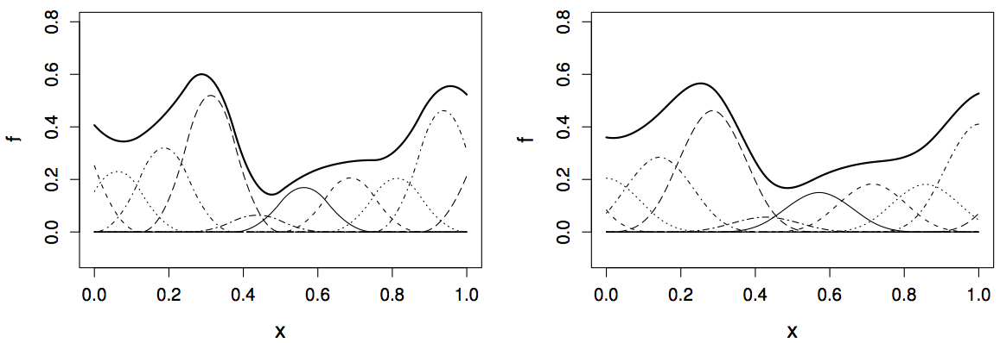

```{r}
#| include: false
knitr::opts_chunk$set(
  echo = TRUE,
  message = FALSE,
  warning = FALSE,
  fig.align = "center",
  fig.height = 9
)
library(tidyverse)
ggplot2::theme_set(ggplot2::theme_light(base_size = 20))
```

# Background

## Recall: Model flexibility vs interpretability

* Generally speaking: trade-off between a model's _flexibility_ (i.e. how "wiggly" it is) and how __interpretable__ it is

. . .

* **Parametric** methods (e.g. linear regression, GLMs): we make an assumption about the functional form, or shape, of $f$ before observing the data


. . .

* **Nonparametric** methods: we do not make explicit assumptions about the functional form of $f$ (i.e., $f$ is estimated from the data)

. . .

* Parametric models are generally easier to interpret, whereas nonparametric models are more flexible


## $k$-nearest neighbors ($k$-NN)

* Perhaps the simplest nonparametric method...

. . .

* Find the $k$ data points __closest__ to an observation $x$, use these to make predictions

  * Need to use some measure of distance, e.g., Euclidean distance
  
. . .  

* Take the average value of the response over the $k$ nearest neighbors

  * $k$-NN classification: most common class among the $k$ nearest neighbors ("majority vote")
  
  * $k$-NN regression: average of the values of $k$ nearest neighbors

. . .

- **The number of neighbors $k$ is a tuning parameter** (like $\lambda$ is for ridge/lasso)

## Finding the optimal number of neighbors $k$

Recall: **bias-variance tradeoff**

. . .

- If $k$ is too small, the resulting model is too flexible: low bias, high variance

. . .

- If $k$ is too large, the resulting model is *not flexible enough*: high bias, low variance

. . .

```{r out.width='70%', echo = FALSE, fig.align='center'}
knitr::include_graphics("http://www.stat.cmu.edu/~pfreeman/Fig_2.16.png")
```

## Moving beyond linearity 

*   The truth is (almost) never linear

. . .

*   But often the linearity assumption is good enough

. . .

*   What if it's not linear?

    *   splines
    
    *   local regression
    
    *   generalized additive models
    
. . .
    
*   The above methods can offer a lot of flexibility, without losing the ease and interpretability of linear models


## Generalized additive models (GAMs)

Resources

* [Book](https://web.archive.org/web/20250101081917/https://reseau-mexico.fr/sites/reseau-mexico.fr/files/igam.pdf): Generalized Additive Models by Simon Wood

* [GAM resources](https://github.com/noamross/gam-resources) GitHub repository

* [`mgcv` workshop](https://noamross.github.io/mgcv-esa-workshop/)

* [Free GAM Course](https://noamross.github.io/gams-in-r-course/)

* [Chapters 7 and 8](https://www.stat.cmu.edu/~cshalizi/ADAfaEPoV/ADAfaEPoV.pdf)

## Generalized additive models (GAMs)

*   Previously: generalized linear models (GLMs) (e.g., linear regression, logistic regression, Poisson regression)

. . .

*   GLM generalizes linear regression to permit non-normal distributions and link functions of the mean $$g(\mathbb E[Y \mid X = x]) = \beta_0 + \beta_1 x_1 + \beta_2 x_2 + \dots + \beta_p x_p$$

. . .

*   What if we replace the linear predictor by additive smooth functions of the explanatory variables?

*   Entering generalized additive models (GAMs) 

    *   relax the restriction that the relationship must be a simple weighted sum
    
    *   instead assume that the response can be modeled by a sum of arbitrary functions of each predictor

## Generalized additive models (GAMs)

*   Allows for flexible nonlinearities in several variables

. . .

*   But retains the additive structure of linear models

. . .

$$g(\mathbb E[Y \mid X = x]) = \beta_0 + s_1(x_1) + s_2(x_2) + \dots + s_p(x_p)$$

. . .

*   Like GLMs, a GAM specifies a link function $g()$ and a probability distribution for the response $Y$

. . .

*   $s_j$ is some smooth function of predictor $j$

. . .

*   GLM is the special case of GAM in which each $s_j$ is a linear function

## Why use smooth functions rather that just coefficients?

*   Relationships between individual predictors and the response are smooth

. . .

*   Estimate the smooth relationships simultaneously to predict the response by adding them up

```{r out.width='80%', echo = FALSE, fig.align='center'}
knitr::include_graphics("https://multithreaded.stitchfix.com/assets/images/blog/fig1.svg")
```

. . .

*   GAMs have the advantage over GLMs of greater flexibility (want to model the covariates flexibly, covariates and response not necessarily linearly related)

. . .

*   A disadvantage of GAMs/smoothing methods is the loss of interpretability

    *   How do we interpret the effect of a predictor on the response?
    
    *   How do we perform inferences for those effects?
    
## Generalized additive models (GAMs)

<center>

{width="750"}

</center>

## Toy example

```{r}
#| echo: false
mtcars |> 
  mutate(across(c(hp, mpg), scale)) |> 
  ggplot(aes(hp, mpg)) +
  geom_point(size = 4) +
  geom_smooth(method = "lm", se = FALSE, color = NA) +
  coord_fixed() +
  labs(x = NULL, y = NULL)
```

## Toy example: linear regression fit

```{r}
#| echo: false
mtcars |> 
  mutate(across(c(hp, mpg), scale)) |> 
  ggplot(aes(hp, mpg)) +
  geom_point(size = 4) +
  geom_smooth(method = "lm", se = FALSE, color = "darkorange") +
  coord_fixed() +
  labs(x = NULL, y = NULL)
```

## Toy example: GAM fit

```{r}
#| echo: false
mtcars |> 
  mutate(across(c(hp, mpg), scale)) |> 
  ggplot(aes(hp, mpg)) +
  geom_point(size = 4) +
  geom_smooth(method = "lm", se = FALSE, color = "darkorange") +
  geom_smooth(method = "gam", se = FALSE, color = "darkblue") +
  coord_fixed() +
  labs(x = NULL, y = NULL)
```
    
## Splines

* A common way to smooth and learn nonlinear functions is to use **splines**

. . .

* Splines can be used to approximate other, more complex functions

. . .

* Splines are functions that are constructed from simpler **basis functions** (usually polynomials)

. . .

* Each basis function $b_k$ has coefficient $\beta_k$. Spline is just the sum $\displaystyle s(x) = \sum_{k=1}^K \beta_k b_k(x)$

```{r, echo = FALSE, out.width="80%", fig.align='center'}

```


## Splines

* We often write linear models in matrix notation: $\boldsymbol {X\beta}$

  * $\boldsymbol X$: design matrix containing values of predictors
  
  * $\boldsymbol \beta$: parameters (model coefficients) we need to estimate
  
. . .
  
* For a GAM it's very similar

  * $\boldsymbol X$: has columns for each basis function, evaluated at each observation

## Splines

* A $k^{\text{th}}$-order spline is a piecewise polynomial function of degree $k$ that is continuous and has continuous derivatives of orders $1, \dots, k − 1$ at its knot points

. . .

* There are **knots** (boundary points for functions) placed at every point

<!-- . . . -->

<!-- * There are $t_1 < \dots <t_p$ such that $f$ is a polynomial of degree $k$ on each of the intervals $(-\infty, t_1], [t_1, t_2], \dots, [t_p, \infty)$ and $f^{(j)}$ is continuous at knots $t_1, \dots, t_p$ for each $j=0,1,\dots,k-1$ -->

. . .

* This requires us to choose the knots (fixed points between which the function is polynomial)

. . .

* We can eliminate the need to choose knots by using a **smoothing spline**


## Smoothing splines

Use __smooth function__ $s(x)$ to predict $y$, control smoothness directly by minimizing the __spline objective function__

$$\sum_{i=1}^n (y_i - s(x_i))^2 + \lambda \int s''(x)^2dx$$

. . .

$$= \text{fit data} + \text{impose smoothness}$$

. . .

$$\longrightarrow \text{model fit} = \text{likelihood} - \lambda \cdot \text{wiggliness}$$

## Smoothing splines

* The most commonly considered case: cubic smoothing splines

$$\text{minimize }\sum_{i=1}^n (y_i - s(x_i))^2 + \lambda \int s''(x)^2dx$$

. . .

* First term: RSS, tries to make $s(x)$ fit the data at each $x_i$

. . .

* Second term: roughness penalty, controls how wiggly $s(x)$ is via tuning parameter $\lambda \ge 0$

  * Balances the accuracy of the fit and the flexibility of the function

  * The smaller $\lambda$, the more wiggly the function
    
  * As $\lambda \rightarrow \infty$, $s(x)$ becomes linear

## Smoothing splines

Goal: Estimate the __smoothing spline__ $\hat{s}(x)$ that __balances the tradeoff between the model fit and wiggliness__

. . .

Remember: [Goldilocks principle](https://en.wikipedia.org/wiki/Goldilocks_principle)

. . .

```{r out.width='90%', echo = FALSE, fig.align='center'}
knitr::include_graphics("https://github.com/noamross/gams-in-r-course/blob/master/images/diffsmooth-1.png?raw=true")
```

<!-- --- -->

<!-- ## Basis functions -->

<!-- * Splines are _piecewise cubic polynomials_ with __knots__ (boundary points for functions) at every point -->

<!-- . . . -->

<!-- * Practical alternative: linear combination of set of __basis functions__ -->

<!-- . . . -->

<!-- * Example: cubic polynomial  -->

<!--   * 4 basis functions: $B_1(x) = 1$, $B_2(x) = x$, $B_3(x) = x^2$, $B_4(x) = x^3$ -->

<!--   * $\displaystyle r(x) = \sum_j^4 \beta_j B_j(x)$ is the regression function -->

<!--   *  __linear in the transformed variables__ $B_1(x), \dots, B_4(x)$ but it is __nonlinear in $x$__ -->

<!-- . . . -->

<!-- *   Extend this idea for splines _piecewise_ using indicator functions so the spline is a weighted sum $$s(x) = \sum_j^m \beta_j B_j(x)$$ -->

<!-- ## Number of basis functions -->

<!-- <br> -->

<!-- ```{r out.width='60%', echo = FALSE, fig.align='center'} -->
<!-- knitr::include_graphics("https://github.com/noamross/gams-in-r-course/blob/master/images/diffbasis-1.png?raw=true") -->
<!-- ``` -->

<!-- Think of this as a tuning parameter -->


# Examples

## Predicting MLB HR probability

* Data available via the [`pybaseball`](https://github.com/jldbc/pybaseball) library in `python`

* [Statcast data](https://baseballsavant.mlb.com/csv-docs) include pitch-level information, pulled from [baseballsavant.com](https://baseballsavant.mlb.com/)

* Example data collected for the entire month of May 2024

```{r}
library(tidyverse)
savant <- read_csv("https://raw.githubusercontent.com/36-SURE/2025/main/data/savant.csv")
batted_balls <- savant |> 
  filter(type == "X") |> 
  mutate(is_hr = as.numeric(events == "home_run")) |> 
  filter(!is.na(launch_angle), !is.na(launch_speed), !is.na(is_hr))
# glimpse(batted_balls)
```

## Predicting HRs with launch angle and exit velocity

HRs are relatively rare and confined to one area of this plot

::: columns
::: {.column width="50%" style="text-align: left;"}

```{r}
#| eval: false
batted_balls |> 
  ggplot(aes(x = launch_speed, 
             y = launch_angle, 
             color = as.factor(is_hr))) +
  geom_point(alpha = 0.2)
```

:::

::: {.column width="50%" style="text-align: left;"}

```{r}
#| echo: false
#| fig-height: 9
batted_balls |> 
  ggplot(aes(x = launch_speed, 
             y = launch_angle, 
             color = as.factor(is_hr))) +
  geom_point(alpha = 0.2)
```


:::

:::

## Predicting HRs with launch angle and exit velocity

There is a sweet spot of `launch_angle` (mid-way ish) and `launch_speed` (relatively high) where almost all HRs occur

::: columns
::: {.column width="50%" style="text-align: left;"}

```{r}
#| eval: false
batted_balls |> 
  group_by(
    launch_angle_bucket = round(launch_angle * 2, -1) / 2,
    launch_speed_bucket = round(launch_speed * 2, -1) / 2
  ) |> 
  summarize(hr = sum(is_hr == 1),
            n = n()) |> 
  ungroup() |> 
  mutate(pct_hr = hr / n) |> 
  ggplot(aes(x = launch_speed_bucket, 
             y = launch_angle_bucket, 
             fill = pct_hr)) +
  geom_tile() +
  scale_fill_gradient2(labels = scales::percent_format(),
                       low = "blue", 
                       high = "red", 
                       midpoint = 0.2)
```


:::

::: {.column width="50%" style="text-align: left;"}

```{r}
#| echo: false
#| fig-height: 9
batted_balls |> 
  group_by(
    launch_angle_bucket = round(launch_angle * 2, -1) / 2,
    launch_speed_bucket = round(launch_speed * 2, -1) / 2
  ) |> 
  summarize(hr = sum(is_hr == 1),
            n = n()) |> 
  ungroup() |> 
  mutate(pct_hr = hr / n) |> 
  ggplot(aes(x = launch_speed_bucket, y = launch_angle_bucket, 
             fill = pct_hr)) +
  geom_tile() +
  scale_fill_gradient2(labels = scales::percent_format(),
                       low = "blue", 
                       high = "red", 
                       midpoint = 0.2)
```

:::
:::

## Fitting GAMs with [mgcv](https://cran.r-project.org/web/packages/mgcv/index.html)

*   Set up training data

```{r}
set.seed(123)
train <- batted_balls |> 
  slice_sample(prop = 0.5)
test <- batted_balls |> 
  anti_join(train)
```

. . .

*   Modeling the log-odds of a home run using non-linear functions of `launch_speed` and `launch_angle` $$
\log \left( \frac{p_{\texttt{is_hr}}}{1 - p_\texttt{is_hr}} \right) = \beta_0 + s_1 (\texttt{launch_speed}) + s_2 (\texttt{launch_angle})$$ where $p_\texttt{is_hr}$ is the probability of a home run

. . .

*   Fit the model with smoothing spline functions `s()`

```{r}
library(mgcv)
hr_gam <- gam(is_hr ~ s(launch_speed) + s(launch_angle),
              family = binomial,
              method = "REML", # more stable solution than default
              data = train)
```

## View model summary

* `mgcv` performs hypothesis tests for the smooth terms --- these are roughly the equivalent of an $F$-test for dropping each term

* Effective degrees of freedom (edf): basically the number of free parameters required to represent the function

* In a smoothing spline, different choices of $\lambda$ correspond to different values of the edf, representing different amounts of smoothness

```{r}
# summary(hr_gam)
library(broom)
# glance(hr_gam)
tidy(hr_gam)
tidy(hr_gam, parametric = TRUE)
```

## Visualize partial response functions

Display the partial effect of each term in the model and how they add up to the overall prediction

```{r}
#| fig-width: 15
library(gratia)
draw(hr_gam)
```

## Model checking

Check whether more basis functions are needed with `gam.check()` based on an approximate test

```{r}
gam.check(hr_gam)
```

## Evaluate prediction accuracy

*   In-sample performance (training set)

```{r}
hr_gam |> 
  augment(type.predict = "response") |> 
  mutate(newdata = train, pred_class = round(.fitted)) |> 
  summarize(correct = mean(is_hr == pred_class))
```

*   Out-of-sample performance (test set)

```{r}
hr_gam |> 
  augment(newdata = test, type.predict = "response") |> 
  mutate(pred_class = round(.fitted)) |> 
  summarize(correct = mean(is_hr == pred_class))
```

## Comparison with a GLM

*   Very few situations in reality where GLMs (with a linear predictor) perform better than an additive model using smooth functions

*   Especially since smooth functions can just capture linear models

```{r}
hr_logit <- glm(is_hr ~ launch_speed + launch_angle, family = binomial, data = train)
```

```{r}
hr_logit |> 
  augment(newdata = train, type.predict = "response") |> 
  mutate(pred_class = round(.fitted)) |> 
  summarize(correct = mean(is_hr == pred_class))
```

```{r}
hr_logit |> 
  augment(newdata = test, type.predict = "response") |> 
  mutate(pred_class = round(.fitted)) |> 
  summarize(correct = mean(is_hr == pred_class))
```

## Continuous interactions as a smooth surface

```{r}
hr_gam_mult <- gam(is_hr ~ s(launch_speed, launch_angle), family = binomial, data = train)
```

Plot the predicted heatmap (response on the log-odds scale)

```{r}
#| fig-width: 15
# draw(hr_gam_mult)
hr_gam_mult |> 
  smooth_estimates() |> 
  ggplot(aes(launch_speed, launch_angle, z = .estimate)) +
  geom_contour_filled()
```

## Continuous interactions as a smooth surface

Plot the predicted heatmap (response on the probability scale)

```{r}
#| fig-width: 15
hr_gam_mult |> 
  smooth_estimates() |> 
  mutate(prob = plogis(.estimate)) |> 
  ggplot(aes(launch_speed, launch_angle, z = prob)) +
  geom_contour_filled()
```

## Evaluate predictions

*   This has one smoothing parameter for the 2D smooth

*   But prediction accuracy does not improve

```{r}
hr_gam_mult |> 
  augment(newdata = train, type.predict = "response") |> 
  mutate(pred_class = round(.fitted)) |> 
  summarize(correct = mean(is_hr == pred_class))

hr_gam_mult |> 
  augment(newdata = test, type.predict = "response") |> 
  mutate(pred_class = round(.fitted)) |> 
  summarize(correct = mean(is_hr == pred_class))
```

## Separate interactions from individual terms with tensor smooths

*   Decompose the smooth into main effects and an interaction with `ti()`

*   Another option: `te()`, representing a tensor product smooth

More complicated model but yet does not improve prediction accuracy

```{r}
hr_gam_tensor <- gam(is_hr ~ s(launch_speed) + s(launch_angle) + ti(launch_speed, launch_angle),
                     family = binomial,
                     data = train)
```

:::: {.columns}

::: {.column width="50%"}

```{r}
hr_gam_tensor |> 
  augment(newdata = train, type.predict = "response") |> 
  mutate(pred_class = round(.fitted)) |> 
  summarize(correct = mean(is_hr == pred_class))
```

:::

::: {.column width="50%"}

```{r}
hr_gam_tensor |> 
  augment(newdata = test, type.predict = "response") |> 
  mutate(pred_class = round(.fitted)) |> 
  summarize(correct = mean(is_hr == pred_class))
```

:::
:::

## Appendix: code to build dataset

```{python}
#| eval: false
# pip install pybaseball
# dictionary: https://baseballsavant.mlb.com/csv-docs
import pandas as pd
from pybaseball import statcast
savant = statcast(start_dt='2025-05-01', end_dt='2025-05-31')
savant.to_csv('savant.csv', index=False)
```